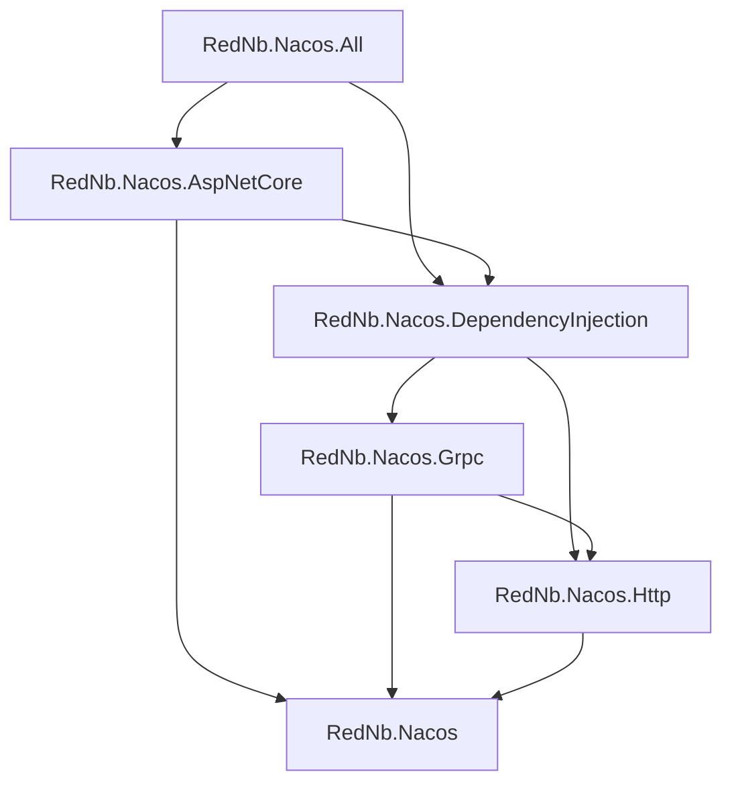

# RedNb.Nacos 完整改进计划

状态：实施与验收记录见文末；原文保留审查基线，当前行为以迁移说明、能力矩阵和测试报告为准。

基线：2026-09-13，master / c4a8959，已合并 PR #7。

## 1. 目标与边界

- 以官方 Nacos 3.2.4 为首个完整验收基线，保留 .NET 8 / .NET 10 支持，不增加 Nacos 2.x 兼容分支。
- “支持 3.x”按实际能力和版本矩阵表达。3.0、3.1 与更早 3.2 的未验证能力不默认承诺支持，3.2.4 之后的新版本也需要回归验证。
- 保留现有模块化方向，改正依赖边界和易用性，不进行一次性重写。
- 不兼容旧服务器，不等于可以无说明地破坏 .NET 调用方的公开 API。公开命名、默认实现和废弃 API 调整集中到新的主版本，建议 2.0.0，并附迁移说明。
- 按当前 master 分阶段实施和验证，不主动创建或切换分支。每阶段使用独立提交，不能把功能修复和全库格式化混在一起。

## 2. 已验证事实

### 2.1 代码与测试基线

- 完整解决方案构建通过：0 错误、30 警告。
- Core：net8/net10 各 388 个测试通过；HTTP：各 144；gRPC：各 77。
- AI 示例测试项目的 IsTestProject 为空，普通 dotnet test 没运行测试；命令行强制为 true 后 12 个测试通过。
- 独立程序复现 gRPC 配置旧缓存：两次读取得到 v1、v1，模拟服务器第二次已改为 v2，实际查询只有一次。
- 这些成绩不是服务器集成测试结果；现有 Fake 测试不能证明真实协议、重连和服务器故障恢复正确。

### 2.2 云端测试环境

本轮已使用用户提供的云端连接信息验证：8080 控制台 readiness 返回 HTTP 200、业务 code=0；8848 用户名密码登录成功；9848 TCP 连接成功。TCP 成功不等同于 gRPC 握手或注册订阅测试通过。一次尝试的 `/v3/client/server/state` 路径返回 404，不作为版本或服务故障判断依据。

地址与密码通过本地环境变量、User Secrets 或 CI Secrets 注入，不写入仓库、示例配置、TRX、日志或本文。后续所有写入测试必须使用专属测试命名空间/资源前缀并清理本次创建的资源。

## 3. 结构评估与目标依赖

当前 src/tests/samples/docs/deploy 的一级目录合理。六个包的数量也合理，暂不再拆出多个新 NuGet 包。问题在边界：核心包不只有抽象，包含后台 Redo、解析器、故障恢复和监控实现；HTTP/Grpc/DI 的职责和命名不一致。

| 类库 | 评价 | 目标职责 |
| --- | --- | --- |
| RedNb.Nacos | 核心方向合理，运行时职责偏多 | 公开契约、模型、配置、错误、能力描述与必要的协议无关公共逻辑；协议专属生命周期移出 |
| RedNb.Nacos.Http | 合理，但公开命名空间混用 Client/Http | HTTP Client/Admin/Console 请求、鉴权、envelope、HTTP 服务实现；明确不同端口和命名空间语义 |
| RedNb.Nacos.Grpc | 合理，连接层和服务层过重 | gRPC 连接、协议 DTO、Config/Naming、AI 端点操作、重连重放 |
| RedNb.Nacos.DependencyInjection | 有必要，但目前默认仅 HTTP | 统一 options 校验、服务选择、注册入口、生命周期与多客户端支持 |
| RedNb.Nacos.AspNetCore | 有必要，当前绑定 HTTP 配置不合理 | IConfiguration 热更新、托管服务注册、健康检查；依赖抽象和统一注册层 |
| RedNb.Nacos.All | 可以保留为便捷入口 | 纯聚合包，不承载运行逻辑；验证仅依赖包也能正确安装 |

目标依赖方向：

Grpc 对 Http 的引用本身不是错误：当前共享鉴权和 AI 的 HTTP 操作有实际用途。先收敛共享入口和所有权，不为消除一条引用而制造新包。禁止反向依赖 DI 或 AspNetCore。将 Grpc 包里的注册扩展迁至专门的 DI 包；必要的旧入口只做清晰的过渡委托。

需要拆分的职责示例：NacosGrpcNamingService 1212 行、HTTP Naming 1079 行、HTTP AI 1056 行、Grpc Config 993 行。按缓存、订阅、重连、协议转换和生命周期拆成可测试组件；不以文件行数为硬指标，也不以拆 partial 文件代替职责拆分。

## 4. 命名与使用规范

当前同时存在 RedNb.Nacos.Core、RedNb.Nacos.Client、RedNb.Nacos.Http、RedNb.Nacos.GrpcClient 等命名空间；Model/Models、Skill/Skills、Ai/AI 的使用也不一致。Core 和 Grpc 中各有一个 NamingGrpcRedoService，容易误用且恢复链尚未打通。

新主版本建议统一：

- 公开核心命名空间使用 RedNb.Nacos.Config / Naming / Ai / Administration 等领域路径；传输实现使用 RedNb.Nacos.Http.*、RedNb.Nacos.Grpc.*。
- C# 类型采用 Ai、Mcp、A2a、Grpc 等固定拼写，模型目录统一 Models；JSON 字段和 gRPC TYPE 保持服务器契约，不跟随 C# 重命名。
- 服务接口按能力拆分，优先注入 IConfigService、INamingService、IPromptService 等窄接口；IAiService 和 INacosFactory 作为方便的聚合入口，不强迫所有调用者依赖全部管理/锁能力。
- Async 后缀与返回 Task/ValueTask 对齐；取消令牌置尾；超时使用统一语义；不要保留名字叫 Stream 却实际发送 Unary 的内部方法。
- 实现细节 DTO、缓存、重试管理器尽可能 internal。已有 public 类型即使仓库内未引用，也必须经过 API 清单与迁移评审，不能直接认定无用。

易用性目标：

- 一个推荐的 AddNacos 入口，Config/Naming 默认 gRPC；管理接口按能力选择 HTTP Admin/Console。
- 只初始化实际使用的模块；不默认激活 Lock/Maintainer/全部 AI。
- 通过 IOptions 统一读取与 ValidateOnStart 校验，避免每个注册工厂重复执行配置委托；支持命名客户端，避免两个 Nacos 实例共用最后一次注册的全局 options。
- 构造函数不启动后台网络任务；连接、停止和 Dispose 由明确生命周期管理。工厂直接创建提供明确的异步就绪入口。
- ASP.NET Core 提供器使用统一服务构建路径；必须在普通 Generic Host 和 WebApplication 两种入口验证，不能假定配置加载时 DI 已完成。
- AI facade 在服务端确有实现的通道间路由；不存在的能力明确报告不支持，不能伪造成功。Console 公共命名空间限制不能被路由逻辑隐藏。
- 新默认用法提供最小 Console、WebApi 和 AI 示例；AI 运行库留在示例依赖中，不传播给普通 SDK 使用者。

## 5. 文件和依赖清理清单

以下均为计划，本轮没有执行删除。

| 对象 | 证据与判断 | 处理与验收 |
| --- | --- | --- |
| src/RedNb.Nacos/project.assets.json | 已被 Git 跟踪，含旧用户目录、旧项目绝对路径；NuGet 生成文件 | P0 删除此文件并补充忽略规则；干净 restore 后不出现新的受跟踪生成文件 |
| src/RedNb.Nacos.All/Placeholder.cs | 只有注释，没有类型 | P6 改为真正聚合包后删除；配合 IncludeBuildOutput=false、pack 和新项目安装验证 |
| docs/superpowers 下 7 个文档 | 约 334 KB，包含历史代理指令、旧版本假设和旧计划 | P6 归档并标注非当前规范，保留有价值的决策；本计划不执行这些历史代理指令 |
| 两份 SDK_COMPLETENESS 文档 | 结论与代码、迁移说明存在冲突 | P6 合并为一个能力矩阵；保留历史链接跳转说明；删除前确认引用 |
| Core/Naming/Redo 与 Grpc/Naming 两套实现 | 核心库公开实现未见生产入口使用，Grpc 内部实现被创建但 RedoAsync 未接通 | P3 选定一套状态机并接通，随后按 API 迁移策略去重，不先删后补 |
| Polly / Polly.Extensions | HTTP csproj 引用，src 的 C# 检索未发现使用 | P6 检查生成/反射/配置与包依赖后删除无用直接引用；restore/build/pack 验证 |
| YamlDotNet | YamlChangeParser 实际使用 | 保留，不作为垃圾依赖；若日后做可选解析包，再独立设计 |
| AiCacheHolder、InstancesDiffer | 分别有运行时调用/测试与故障恢复调用 | 保留；名称带 Cache 不代表可删 |
| bin/obj/TestResults | 本机构建产物，已忽略 | 不入库；按需清理，非源码治理成果 |
| 仓库同级 pr1-source/pr7-source、zip、审查镜像目录 | 属于此前审查材料，不在项目 Git 范围内 | 不随仓库清理删除，另行确认保留需求 |
| LICENSE、贡献说明、有效迁移文档 | 发布和协作所需 | 保留并修正失效链接，不因是模板或 AI 生成就删除 |

清理原则：先列调用和公开 API，再移动/删除；不按“AI 文件”“长文件”或“搜索不到一次调用”直接删除。清理提交独立于行为修复。所有递归删除严格限制于确认过的目标目录。

## 6. 分阶段任务与退出条件

### P0：测试入口、云端配置和基线（先做）

- T00 修复 AI 示例 IsTestProject=true，CI 对零测试发现报错；固定当前 1230 个框架测试实例的基线。
- T01 将 NacosServerFixture 硬编码 localhost/nacos 凭据改为环境变量；读取 Server/Console 地址、用户名密码、测试 namespace，统一健康检查，所有集成测试复用配置。
- T02 云端先做版本、认证、HTTP、gRPC 握手和只读探测；确认专属空间后才能执行创建/更新/删除测试。AI Console 只能使用 public 时采用唯一前缀和资源清单，禁止清空 public。
- T03 删除误入库的 project.assets.json，建立公开 API 和包依赖基线；加入 master CI（Core/HTTP/gRPC/AI Sample 全覆盖）、global.json 和确定的包版本。外部 PR 不获得云端凭据，常规 CI 使用临时本地容器。
- T04 建立最小 pack 验证，保护版本、作者、许可证、README 和 XML 文档，避免重演 PR #1 的属性加载顺序问题。

退出：普通 dotnet test 能实际执行全部单测；云端参数不进仓库；基线失败可重复定位；禁止以缺少服务器为理由把集成测试悄悄变成绿色。

### P1：配置正确性与 ASP.NET Core 热更新

- T10 普通 GetConfigAsync 默认读取服务器或使用明确定义的有限缓存；监听状态、读取缓存和故障快照分离。
- T11 处理 ConfigBatchListen 响应 changedConfigs，不能丢弃；校验业务错误并补订阅竞争窗口测试。
- T12 正确处理外部删除配置，清理缓存并发送删除通知；权限拒绝与配置不存在、网络故障分别处理。
- T13 迁移 HTTP 监听和 ASP.NET Core 配置提供器；纯 HTTP 不支持的监听入口不能静默成功。普通监听、GetConfigAndSignListener、ReloadOnChange、IOptionsMonitor 均纳入验收。
- T14 统一超时、取消和快照回退；取消不当作故障回退成功，权限错误不能被旧缓存掩盖。

退出：两个独立客户端的读取→修改→再次读取、首次读取/订阅之间修改、外部删除、拒绝访问、断网回退和恢复全部按预期；WebApi 中实际观察配置重载。

### P2：默认鉴权和协议错误语义（可在 P1 后单独提交）

- T20 删除默认鉴权对 AK/SK 登录的错误假设；默认策略为用户名密码/token，云服务或插件签名另列能力，不实现无效回退。
- T21 token 刷新、并发登录、401/403、过期与凭据错误分别验证；日志不得输出密码/token。
- T22 统一 HTTP envelope 与 gRPC 响应错误映射；拒绝、不存在、限流、格式错误不能自动视作空数据或成功。

退出：实际云端用户名密码登录成功；故意错误凭据/过期 token 得到可诊断错误；不存在的 AK/SK 能力明确拒绝。

### P3：连接恢复、Naming 一致性和模糊监听

- T30 后台重连协调器、连接代次和就绪确认；SetupAck 超时不能直接报告已连接，stream 正常结束也要处理。
- T31 接通注册/订阅 Redo，失败项保留重试；注册、注销和重放并发时不得复活已注销实例。统一两套 Redo 实现。
- T32 配置监听、Naming 和 AI 临时端点恢复；没有主动业务请求时也能恢复。
- T33 分离 Naming TTL 和差异快照，修复 RemovedInstances/AddedInstances；覆盖最后一个实例下线、元数据和健康变化。
- T34 接通 Config/Naming Fuzzy Watch，或对不支持通道明确拒绝；不能只修改本地 watcher 字典。
- T35 健康检查分为连接健康和服务器/控制台健康；支持显式 ConsoleAddresses，移除旧 v1 探测路径。

退出：本地专用容器重启/断网后注册与订阅恢复；服务层无新主动请求也恢复。云端不进行未经约定的重启或全局故障注入。

### P4：类库边界、命名和统一使用入口

- T40 冻结新主版本公开 API 命名表及旧→新映射，再做机械命名迁移；协议字段不变。
- T41 按第 3 节依赖图整理六包；传输生命周期不留在核心抽象层，必要共享逻辑保留小而明确的内部组件。
- T42 统一 DI/工厂/Options，默认 gRPC Config/Naming，取消默认注册无关模块；支持多客户端和确定的资源所有权。
- T43 服务按缓存/订阅/协议/生命周期分解；测试迁移跟随职责而非文件数。
- T44 更新最小示例、XML 文档和迁移说明；从空 Console/WebApi 项目安装本地产出的包验证，避免只能通过源码引用运行。

退出：无循环依赖；只使用 Config 的程序不初始化 AI/Lock；普通使用不需要手动拼接多个具体 transport；两套客户端配置和 Dispose 互不影响。

### P5：AI 与管理能力补齐

- T50 MCP/A2A/Prompt/Skill/AgentSpec 建立逐方法矩阵：服务器最低版本、HTTP/gRPC 通道、namespace 语义、测试状态。
- T51 在服务器存在对应能力时实现组合路由；不支持的操作返回统一能力错误，不依靠 try/catch 掩盖 404/501。
- T52 验证轮询订阅、退订、版本标签、发布/下线、ZIP 上传下载、并发取消和资源清理；恢复被历史环境问题 Skip 的测试。
- T53 Maintainer 按 3.2.4 Admin/Console 重写所需功能，旧 v2 实现明确淘汰；Lock 单独给出支持决策和实测，不再同时宣传“完整支持”与“将移除”。

退出：矩阵中每一个支持项对应有效测试；未实现项不被勾成完成；AI 运行时框架依赖不进入基础 SDK 包。

### P6：文件清理、依赖治理和文档发布

- T60 执行第 5 节清单，独立提交；保留必要历史决策和链接。
- T61 导入修正后的集中包管理与 MSBuild 配置，锁定浮动版本，升级测试工具的有漏洞传递依赖。不能直接合并 PR #1 原样配置。
- T62 All 变为纯聚合包并删除空 Placeholder；验证 NuGet 的完整依赖闭包与包内容。
- T63 文档分为用户指南、当前能力矩阵、迁移说明、贡献指南、历史档案；统一 Model/Models、README 中仓库链接和部署说明。
- T64 .editorconfig 先约定再执行，全库格式化只做一次独立提交；.slnx 和 Husky 不是功能验收前置条件。

退出：无跟踪生成物、无运行时凭据、无失效文档链接；pack 元数据完整；新机器可通过文档完成构建、测试和安装。

### P7：正式验收和发布

- 全量 Debug/Release 构建与 .NET 8/10 单测；实际发现数量受检查。
- 真实 Nacos 3.2.4 的默认鉴权、命名空间、配置 CRUD/CAS/监听/删除、Naming 注册/发现/订阅/恢复、AI 矩阵逐项验收。
- 临时本地容器承担重启/断网/延迟/并发测试，云端承担正常功能联调；TLS/代理/集群未测项单独列出，不声称已支持。
- NuGet pack、本地源安装、API 差异、许可/README/XML 文档、依赖与秘密扫描通过。
- 新主版本发布说明说明停止 2.x 支持、3.x 版本矩阵、公开 API/默认通道变化和迁移示例。
- 每项记录提交 SHA、服务端版本、.NET 框架、测试命令及结果。全部门禁满足后才能更新“已完成”状态。

## 7. 推荐执行节奏

P0 → P1 → P2 → P3 → P4 → P5 → P6 → P7。P0 的 CI/打包基线尽早建立；P4 的命名和边界设计先冻结，但大规模移动放在核心行为回归测试之后。每阶段以退出条件结束，不给缺乏依据的固定工期承诺。

当前仅 P0 中的云端可达性和基线调查已完成，不能据此将 P0 整体标为完成。下一步最适合从 T00/T01/T03/T04 开始，使后续改动有可重复的验证门禁。

## 8. 实施记录（2026-09-13）

| 阶段 | 本次落地 |
| --- | --- |
| P0 | AI 测试发现修复、环境变量 fixture、master CI、生成物清理、SDK 固定、包校验脚本 |
| P1 | 新鲜读取、监听响应、外部删除、取消、ASP.NET Core 热更新和隔离快照 |
| P2 | 默认认证契约修复、错误响应映射、移除无效 AK/SK 登录实现 |
| P3 | 后台重连、注册重放、MCP 端点恢复、差异快照、3.2.4 模糊监听初始同步、健康检查 |
| P4 | 六包边界、命名空间/Models 统一、DI 移动、命名客户端、按需启动轮询、快照组件提取 |
| P5 | AI facade 自动路由、轮询与真实生命周期、v3 命名空间管理、原生 gRPC mutex；旧运维能力明确不支持 |
| P6 | 两套 Redo 去重、All 空 DLL 删除、历史文档归档、CPM/依赖升级、当前文档重写 |
| P7 | Debug/Release 构建、本地/云端矩阵、故障注入、包内容及安装验证；结果以 TEST_REPORT.md 为准 |

新包仅在本地生成，未自动发布到 NuGet 或创建 GitHub Release。旧 Maintainer 的全部运维端点未宣称重写完成；本轮明确支持的管理功能为 IAdministrationService 的命名空间生命周期。TLS/代理/集群认证和 AI 全参数组合属于单独验证范围。
